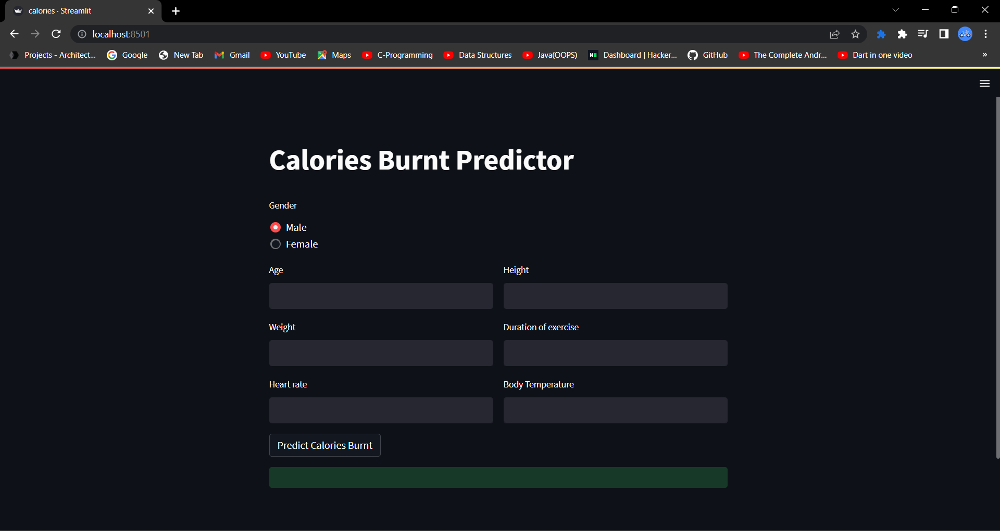
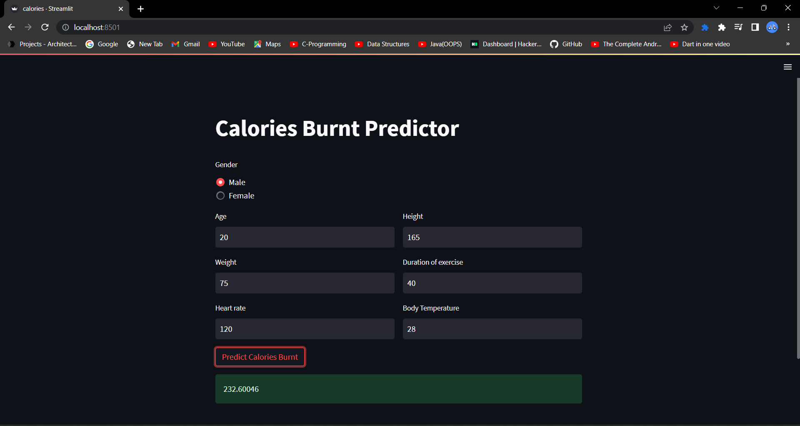
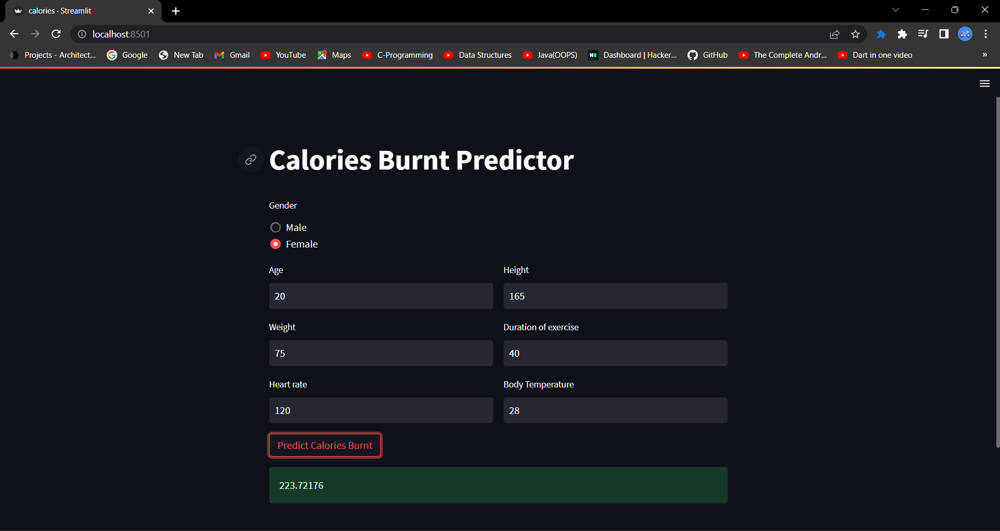

# cal_predict
## Table of Content
* [Overview](https://github.com/ms070902/cal_predict/new/main?readme=1#overview)
* [Technologies Used](https://github.com/ms070902/cal_predict/new/main?readme=1#technologies-used)
* [Result](https://github.com/ms070902/cal_predict/new/main?readme=1#result)
* [Author](https://github.com/ms070902/cal_predict/new/main?readme=1#author)
## Overview
* cal_predict is a calorie burnt prediction ml model that predicts the calories burnt post workout by user based on factors like grnder, height, weight, age,
  duration of excercise, body temperature, and heart rate.
* The model is trained using XGBoost Regression algorithm which helps to achieve the accuracy of around 98%.

## Technologies Used
* Model Training
  * Google Colab (Python using XGBoost Regressor)
* Environment Management System
  * Anaconda
* Framework to Deploy ML model
  * Streamlit

## Result
</img>
</img>
</img>

## Author
* Mihir Shah
   * [LinkedIn](https://www.linkedin.com/in/ms070902/)
